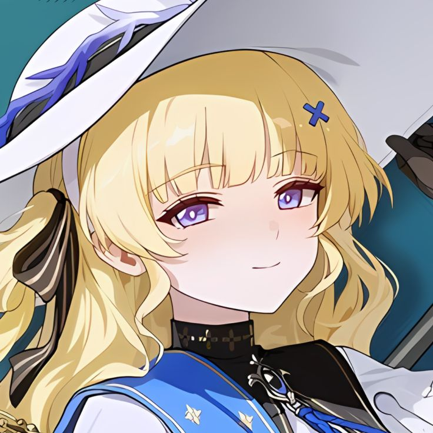
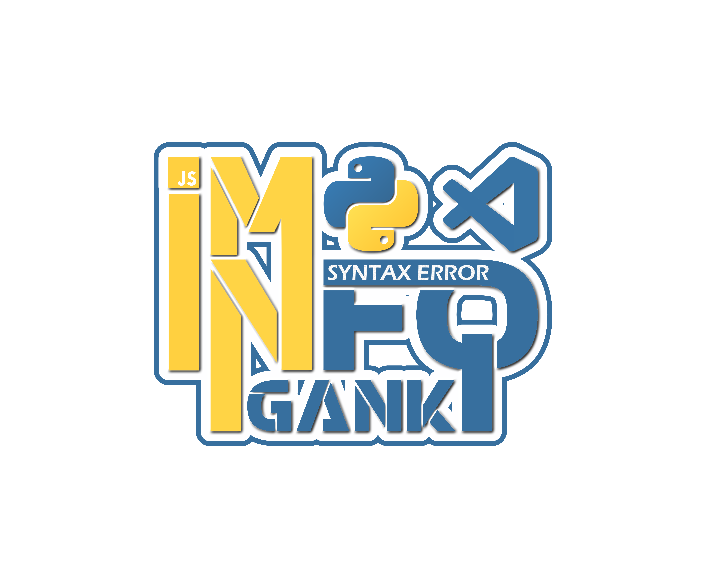

<!-- TOP WAVE -->


<!-- BANNER -->
<div align="center">
  
</div>

<br>

<!-- IDENTITY -->
<div align="center">

  

  <br><br>

  

  

  <br>

  [](https://github.com/Akane-UX)
  [](https://github.com/Akane-UX?tab=followers)
  [](https://github.com/Akane-UX)

</div>

<br>

---

<!-- ABOUT -->


**`> cat ~/about.yml`**

```yaml
name      : AVRIL
role      : Software Engineering Student
stack     : C / C++ / Golang / Python / JS / QML
interests : CyberSec · Open Source · Photography
os        : Arch Linux  — btw
vibe      : Night owl. Always building something.
```

**`> ./now`**

- 🔭 &nbsp; Working on **C++** and **Go** side projects
- 🛡️ &nbsp; Studying **Cyber Security** concepts
- 📸 &nbsp; Experimenting with photography & visual design
- ☕ &nbsp; Fueled by caffeine and late-night quiet

<br clear="right" />

---

<!-- STACK -->

**`> ls -1 ~/stack`**

<div align="center">
  
  <br><br>
  
</div>

---

<!-- STATS -->

**`> git log --oneline --all --stat`**

<div align="center">

  
  &nbsp;&nbsp;
  

  <br><br>

  

</div>

---

<!-- TROPHIES -->

**`> ./achievements --verbose`**

<div align="center">
  
</div>

---

<!-- ACTIVITY -->

**`> tail -f ~/.bash_history`**

<div align="center">
  <picture>
    <source media="(prefers-color-scheme: dark)" srcset="https://raw.githubusercontent.com/platane/snk/output/github-contribution-grid-snake-dark.svg" />
    <source media="(prefers-color-scheme: light)" srcset="https://raw.githubusercontent.com/platane/snk/output/github-contribution-grid-snake.svg" />
    
  </picture>

  <br><br>

  
</div>

---

<!-- TEAM -->

**`> cat /etc/team`**

<div align="center">
  
</div>

---

<!-- FOOTER -->

<div align="center">

```c
// main.c
int main() {
    while (alive()) {
        eat();
        sleep();
        code();
        college();
    }
    return 0;
}
```


<sub>crafted with caffeine &amp; curiosity &nbsp;&middot;&nbsp; <a href="https://github.com/Akane-UX">@Akane-UX</a></sub>

</div>
