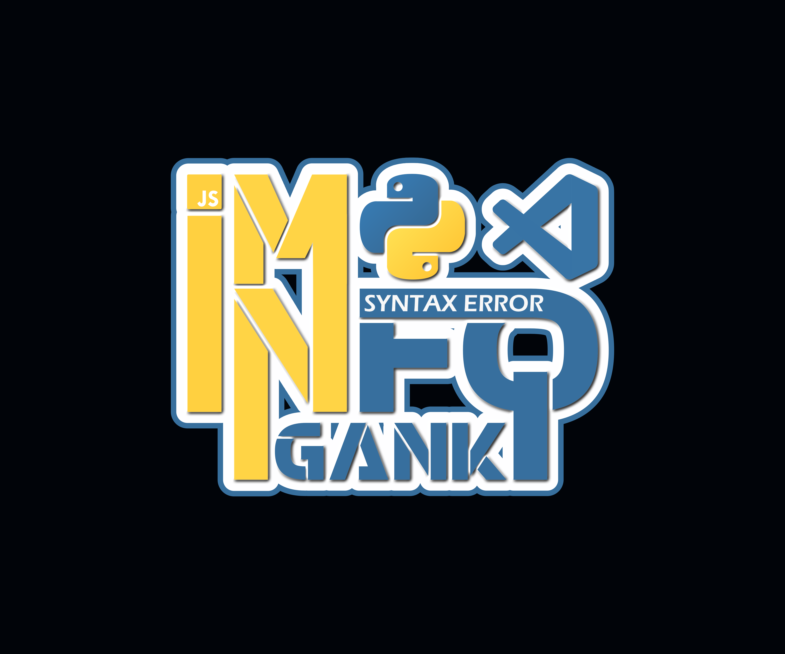

<div align="center">
  
</div>

<br>

<div align="center">
  
  <br><br>

  
  
  <br>

  [](https://akane-ux.github.io/Portofolio/)
  [](https://github.com/Akane-UX)
  [](https://github.com/Akane-UX)
</div>

<br>

---

## Identity_Matrix


```bash
> name
AVRIL

> cat /sys/class/role
UI/UX - FrontEnd - Blue Team

> cat /sys/class/objective
Linux Sysadmin & Penetration Testing & Electronics

> cat /sys/class/traits
Introvert, lazy as fck

> echo $STACK
C++, Go, Python, JavaScript, QML

> status
Depressed / anxious / overthinking
```

<br clear="right" />

---

## Arsenal

<div align="center">
  
</div>

<br>

---

## Telemetry

<div align="center">
  
  <br><br>
</div>
<br>

---

## Activity Log

<div align="center">
  <picture>
    <source media="(prefers-color-scheme: dark)" srcset="https://raw.githubusercontent.com/platane/snk/output/github-contribution-grid-snake-dark.svg" />
    <source media="(prefers-color-scheme: light)" srcset="https://raw.githubusercontent.com/platane/snk/output/github-contribution-grid-snake.svg" />
    
  </picture>
</div>

<br>

---

##  Team

<div align="center">
  
</div>

<br>

---

<div align="center">
  
```c
int main() {
    while (alive()) {
        eat();
        sleep();
        code();
        repeat();
    }
    return 0;
}
```


<sub>crafted with caffeine &amp; curiosity &nbsp;&middot;&nbsp; <a href="https://github.com/Akane-UX">@Akane-UX</a></sub>

</div>
